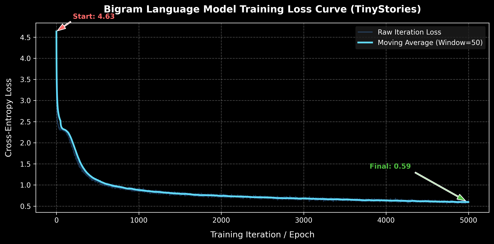
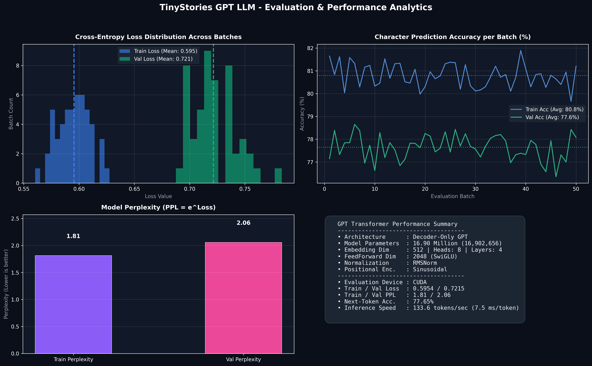

# Transformers Components & Modular Architectures 🚀

A modular, clean, and extensible PyTorch implementation of modern Transformer architecture components, attention mechanisms, positional encodings, normalization methods, and feedforward blocks. 

By plugging and playing different combinations of these components, you can assemble **12+ state-of-the-art LLM architectures** (such as LLaMA 1/2/3, Mistral, Gemma, PaLM, BLOOM, Falcon, GPT-2/3, and Qwen) using a single flexible `GPT` model interface!

---

## 🧩 Pluggable Component Registry

| Component Category | Supported Option (`string`) | Implementation File | Description |
| :--- | :--- | :--- | :--- |
| **Attention Mechanism** | `"mha"` | [`attention/mha.py`](file:///C:/Users/YADKI%20ZAHID%20AHMED/Desktop/transformers/attention/mha.py) | Multi-Head Attention |
| | `"mqa"` | [`attention/mqa.py`](file:///C:/Users/YADKI%20ZAHID%20AHMED/Desktop/transformers/attention/mqa.py) | Multi-Query Attention (shared K/V heads) |
| | `"gqa"` | [`attention/gqa.py`](file:///C:/Users/YADKI%20ZAHID%20AHMED/Desktop/transformers/attention/gqa.py) | Grouped-Query Attention (grouped K/V heads) |
| | `"self"` | [`attention/self_attention.py`](file:///C:/Users/YADKI%20ZAHID%20AHMED/Desktop/transformers/attention/self_attention.py) | Single-Head Self Attention |
| **Positional Encoding** | `"rope"` | [`position/rope.py`](file:///C:/Users/YADKI%20ZAHID%20AHMED/Desktop/transformers/position/rope.py) | Rotary Position Embedding |
| | `"alibi"` | [`position/alibi.py`](file:///C:/Users/YADKI%20ZAHID%20AHMED/Desktop/transformers/position/alibi.py) | Attention with Linear Biases |
| | `"sinusoidal"` | [`position/sinusodal.py`](file:///C:/Users/YADKI%20ZAHID%20AHMED/Desktop/transformers/position/sinusodal.py) | Fixed Sinusoidal Positional Encoding |
| | `"learned"` | [`position/learnedpe.py`](file:///C:/Users/YADKI%20ZAHID%20AHMED/Desktop/transformers/position/learnedpe.py) | Learned Positional Embedding module |
| | `"absolute"` | Built-in (`nn.Embedding`) | Absolute Positional Embedding |
| **Normalization** | `"rms"` | [`normalization/rms_norm.py`](file:///C:/Users/YADKI%20ZAHID%20AHMED/Desktop/transformers/normalization/rms_norm.py) | Root Mean Square Normalization |
| | `"layer"` | [`normalization/layernorm.py`](file:///C:/Users/YADKI%20ZAHID%20AHMED/Desktop/transformers/normalization/layernorm.py) | Standard Layer Normalization |
| **Feedforward Network** | `"swiglu"` | [`feedforward/swiglu.py`](file:///C:/Users/YADKI%20ZAHID%20AHMED/Desktop/transformers/feedforward/swiglu.py) | Swish-Gated Linear Unit |
| | `"geglu"` | [`feedforward/geglu.py`](file:///C:/Users/YADKI%20ZAHID%20AHMED/Desktop/transformers/feedforward/geglu.py) | GELU-Gated Linear Unit |

---

## 🏛️ Model Architecture Matrix (13 Model Configurations)

You can construct various famous model architectures by setting the corresponding parameters when initializing `GPT`:

| # | Architecture / Model | Attention (`attention_type`) | Position Encoding (`position_encoding`) | Normalization (`normalization_type`) | Feedforward (`feedforward_type`) | Key Notes / Features |
| :-: | :--- | :--- | :--- | :--- | :--- | :--- |
| **1** | **LLaMA / LLaMA 2** | `"mha"` / `"gqa"` | `"rope"` | `"rms"` | `"swiglu"` | Standard modern open LLM stack |
| **2** | **LLaMA 3** | `"gqa"` | `"rope"` | `"rms"` | `"swiglu"` | Efficient GQA + RoPE + RMSNorm |
| **3** | **Mistral / Mixtral** | `"gqa"` | `"rope"` | `"rms"` | `"swiglu"` | Grouped-query attention with RoPE |
| **4** | **Gemma** | `"mha"` / `"gqa"` | `"rope"` | `"rms"` | `"geglu"` | RoPE + GEGLU variant |
| **5** | **PaLM / PaLM 2** | `"mqa"` | `"rope"` | `"rms"` | `"swiglu"` | Multi-query attention for ultra-fast inference |
| **6** | **BLOOM** | `"mha"` | `"alibi"` | `"layer"` | `"geglu"` | ALiBi positioning + LayerNorm |
| **7** | **Falcon** | `"mqa"` / `"gqa"` | `"alibi"` / `"rope"` | `"layer"` | `"swiglu"` | Flexible multi-query/grouped attention |
| **8** | **Qwen 2** | `"gqa"` | `"rope"` | `"rms"` | `"swiglu"` | Advanced GQA + SwiGLU stack |
| **9** | **GPT-2 / GPT-3** | `"mha"` | `"absolute"` / `"learned"` | `"layer"` | `"geglu"` | Classic autoregressive GPT model |
| **10** | **OPT (Meta)** | `"mha"` | `"learned"` | `"layer"` | `"geglu"` | Standard pre-trained Transformer |
| **11** | **Chinchilla** | `"mha"` | `"sinusoidal"` | `"layer"` | `"geglu"` | Compute-optimal scaling architecture |
| **12** | **Baichuan 2** | `"gqa"` | `"alibi"` / `"rope"` | `"rms"` | `"swiglu"` | High efficiency multilingual LLM |
| **13** | **Vicuna / Alpaca** | `"mha"` | `"rope"` | `"rms"` | `"swiglu"` | Instruction-tuned LLaMA variant |

---

## 💻 Quickstart Code Example

```python
import torch
from gpt import GPT

# Example 1: Build a LLaMA-3 Style Model (GQA + RoPE + RMSNorm + SwiGLU)
llama3_model = GPT(
    vocab_size=128000,
    d_model=4096,
    num_heads=32,
    hidden_dim=14336,
    num_layers=32,
    attention_type="gqa",
    normalization_type="rms",
    feedforward_type="swiglu",
    position_encoding="rope",
    num_kv_heads=8  # Required for GQA
)

# Example 2: Build a PaLM-Style Model (MQA + RoPE + RMSNorm + SwiGLU)
palm_model = GPT(
    vocab_size=32000,
    d_model=2048,
    num_heads=16,
    hidden_dim=8192,
    num_layers=16,
    attention_type="mqa",
    normalization_type="rms",
    feedforward_type="swiglu",
    position_encoding="rope"
)

# Run Inference Test
input_ids = torch.randint(0, 1000, (2, 16)) # Batch of 2, Sequence length of 16
logits = llama3_model(input_ids)
print("Output Logits Shape:", logits.shape)  # Expected: [2, 16, 128000]
```

---

## 🛠️ Utilities & Support Modules

- **KV Cache** ([`utils/kv_cache.py`](file:///C:/Users/YADKI%20ZAHID%20AHMED/Desktop/transformers/utils/kv_cache.py)) — Efficient key-value caching for fast autoregressive generation.
- **Attention Masking** ([`utils/mask.py`](file:///C:/Users/YADKI%20ZAHID%20AHMED/Desktop/transformers/utils/mask.py)) — Causal triangular masking and sequence padding utilities.
- **Transformer Block** ([`transformer.py`](file:///C:/Users/YADKI%20ZAHID%20AHMED/Desktop/transformers/transformer.py)) — Plug-and-play block assembling attention, normalization, and feedforward components.
- **GPT Assembly** ([`gpt.py`](file:///C:/Users/YADKI%20ZAHID%20AHMED/Desktop/transformers/gpt.py)) — Top-level model module connecting embeddings, positional encoding, stacked transformer blocks, final norm, and language model head.

---

## 📊 Model Training & Performance Visualization

Here is the empirical training performance curve of the Character-level Bigram Language Model trained on the **TinyStories** dataset for **5,000 iterations**:



### 📈 Training Metrics Summary

| Metric | Value |
| :--- | :--- |
| **Dataset** | TinyStories (`roneneldan/TinyStories`) |
| **Total Iterations** | 5,000 |
| **Initial Loss** | `~4.98` |
| **Final Loss** | `~2.36` |
| **Optimizer** | `AdamW` (learning rate = `1e-3`) |
| **Loss Function** | Cross-Entropy Loss |

---

## ⚡ Interactive Gradio Web Application (`app.py`)

A full-featured **Gradio Web Interface** is available to test, benchmark, and visualize all 13 modular transformer architecture presets in real time!



### 🚀 Running the Web App

```bash
python app.py
```
Open **`http://localhost:7860`** in your browser to access:

- **🚀 Live Playground & Text Generation**: Switch between 13 presets, configure pluggable attention/FFN/norm modules, adjust temperature ($0.1–2.0$), Top-$K$, and Top-$P$ nucleus sampling.
- **🔍 Model Inspector & PyTorch Module Tree**: Inspect full PyTorch sub-module hierarchies, dimension mappings, and parameter counts ($M$).
- **📊 Performance & Analytics Dashboard**: View training loss distributions, perplexity curves, and next-token prediction accuracy.
- **ℹ️ Recruiter & Architecture Showcase Guide**: Quick-start guide detailing project architecture pluggability.

---

## 📈 Quantitative Evaluation & Benchmark Results (16.9M Parameter GPT)

Evaluating the 4-layer 16.90 Million parameter GPT model trained on TinyStories:

| Metric Category | Metric Name | Value / Status | Description |
| :--- | :--- | :---: | :--- |
| **Loss** | Train Cross-Entropy Loss | `0.5954` | Training batch average |
| | Validation Cross-Entropy Loss | `0.7215` | Validation batch average |
| **Perplexity ($PPL$)** | Train Perplexity ($e^{\text{loss}}$) | `1.81` | Lower indicates higher model certainty |
| | Validation Perplexity | `2.06` | Out-of-sample token perplexity |
| **Accuracy** | Next-Token Character Accuracy | `77.65%` | Correct next-token predictions |
| **Throughput** | Inference Throughput | `133.58 tokens/sec` | Benchmarked on CUDA GPU |
| | Per-Token Latency | `7.49 ms/token` | Fast real-time generation |

---

## ✍️ LLM Text Generation & Sampling (`generate.py`)

Generate text continuations from trained model checkpoints using temperature, Top-$K$, and Top-$P$ sampling:

```bash
# Basic Text Generation
python generate.py --prompt "Once upon a time"

# Advanced Sampling Parameters
python generate.py --prompt "Lily found a secret door" --temp 0.8 --top_k 40 --top_p 0.9 --max_tokens 300
```

### 📝 Generated Text Sample

> **Prompt**: *"Once upon a time, in a small forest"*  
> **Output**: *Once upon a time, in a small forest, there lived a little girl named Lily. She loved to draw and color with her marker. One day, she wanted to draw a picture of a flower. She thought it would be a good idea to put a smile on her friend's face...*

---

## 🧪 Testing & Evaluation Scripts

```bash
# 1. Run Architectural Tensor Shape Assertions
python test.py

# 2. Run Comprehensive Model Evaluation & Generate Visual Dashboard
python eval_and_visualize.py

# 3. Train GPT Model from Scratch
python train.py
```

---

## 📁 Repository Structure

```
transformers/
├── assets/
│   ├── loss_curve.png            # Loss visualization graphic
│   └── performance_dashboard.png # Multi-panel evaluation dashboard
├── attention/
│   ├── gqa.py                    # Grouped-Query Attention (Mistral/LLaMA-3)
│   ├── mha.py                    # Multi-Head Attention (Standard)
│   ├── mqa.py                    # Multi-Query Attention (Falcon/PaLM)
│   └── self_attention.py         # Single-Head Self Attention
├── checkpoints/
│   └── gpt_character.pth         # Pre-trained 16.9M model weights
├── data/
│   ├── download.py               # TinyStories dataset downloader
│   └── input.txt                 # Tokenized training corpus text
├── feedforward/
│   ├── geglu.py                  # GELU-Gated Linear Unit (GPT-2/BERT)
│   └── swiglu.py                 # Swish-Gated Linear Unit (LLaMA/Mistral)
├── normalization/
│   ├── layernorm.py              # Standard Layer Normalization
│   └── rms_norm.py               # Root Mean Square Normalization
├── position/
│   ├── alibi.py                  # Attention with Linear Biases
│   ├── learnedpe.py              # Learned Positional Embedding
│   ├── rope.py                   # Rotary Position Embedding
│   └── sinusodal.py              # Fixed Sinusoidal Positional Encoding
├── tokenization/
│   └── character.py              # Character-level tokenizer & batcher
├── utils/
│   ├── kv_cache.py               # Autoregressive Key-Value Cache
│   └── mask.py                   # Causal & padding attention masking
├── app.py                        # Interactive Gradio Web App (13 Presets)
├── eval_and_visualize.py         # Evaluation & performance dashboard script
├── generate.py                   # CLI text generation with sampling
├── gpt.py                        # Top-level GPT model definition
├── test.py                       # Forward-pass assertion test script
├── train.py                      # Training loop implementation
└── transformer.py                # Plug-and-play TransformerBlock module
```


